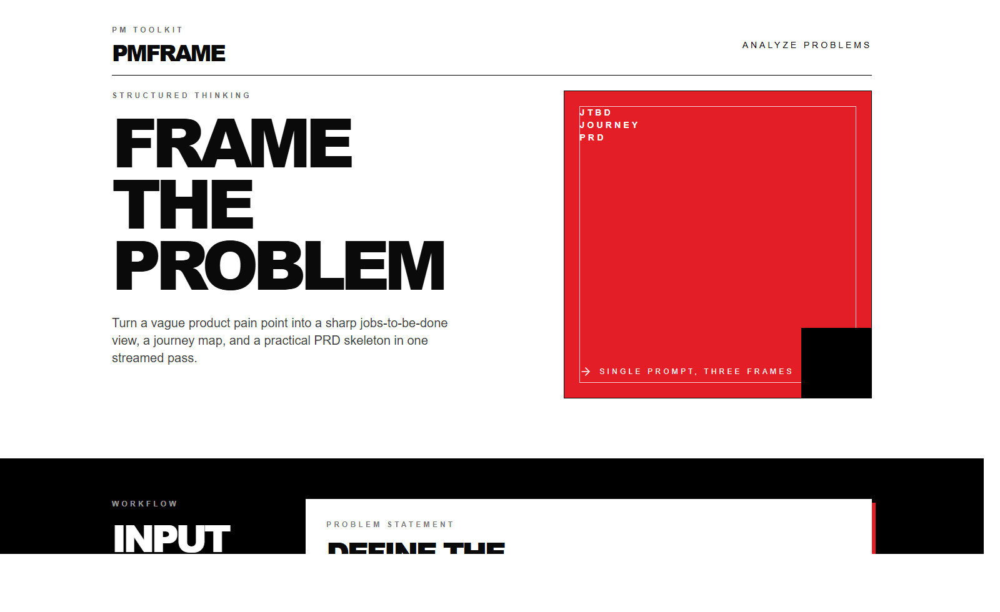
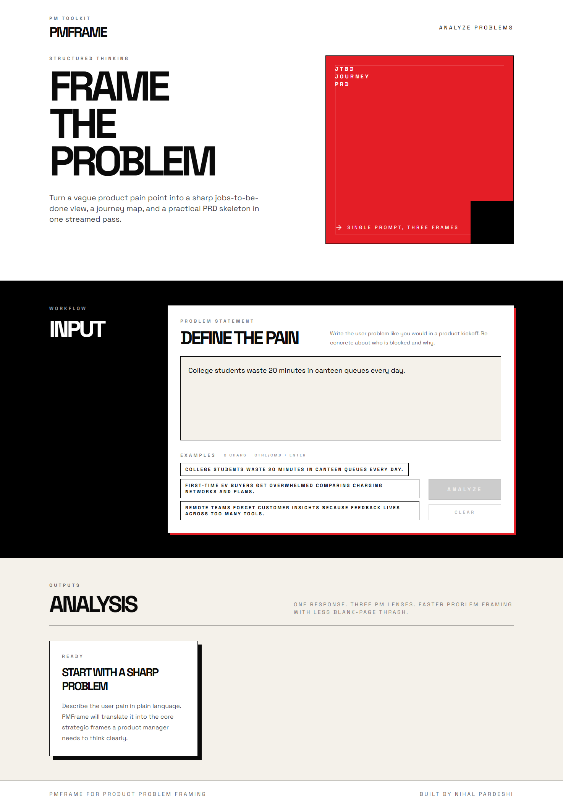

# PM Frame

PM Frame is a frontend-first product thinking tool that turns one raw problem statement into three practical outputs in a single run:

- `JTBD` to clarify the core user job
- `Journey Map` to break down behavior, pain, and opportunity across stages
- `PRD Skeleton` to turn strategy into an execution-ready outline

It is designed for fast problem framing. You paste a messy product problem, and the app streams structured PM artifacts back into the UI instead of making you wait for one giant response.

## Screenshots

### Landing Experience



### Generated Output



## Why It Exists

Early product thinking often gets stuck in one of two places:

- the problem statement is too vague to act on
- the team jumps into solutions before aligning on user context

PM Frame is built to reduce that gap. It helps turn a rough input into something a PM, founder, or product team can actually discuss, refine, and build from.

## What It Generates

### 1. Jobs To Be Done

Breaks the problem into:

- core job
- functional jobs
- emotional jobs
- social jobs
- underserved outcomes

### 2. User Journey Map

Maps the problem across five stages:

- `Trigger`
- `Explore`
- `Decide`
- `Use`
- `Reflect`

Each stage includes:

- user action
- emotional state
- pain point
- PM opportunity

### 3. PRD Skeleton

Builds a lightweight product requirements draft with:

- problem statement
- primary and secondary users
- north star and guardrails
- must-have and nice-to-have features
- out-of-scope boundaries
- open questions

## Product Experience

PM Frame is intentionally opinionated:

- bold editorial UI rather than default dashboard styling
- streamed responses so the interface updates progressively
- strict structured output parsing to keep the response usable
- frontend-only architecture with no custom backend

## Tech Stack

- `React 19`
- `Vite`
- `Tailwind CSS`
- `Lucide React`
- `Groq API`
- model: `llama-3.3-70b-versatile`

## How It Works

1. The user enters a product problem statement.
2. The app sends that prompt directly to Groq from the frontend.
3. The model returns structured JSON for `jtbd`, `journeyMap`, and `prd`.
4. The UI streams partial output and normalizes it as data arrives.
5. Cards render only when the content is meaningfully usable.

There is no backend in this project. The API key is read from a Vite environment variable.

## Local Setup

### 1. Install dependencies

```bash
npm install
```

### 2. Create your env file

```bash
cp .env.example .env
```

Add your Groq key:

```bash
VITE_GROQ_API_KEY=your_key_here
```

### 3. Start the dev server

```bash
npm run dev
```

### 4. Build for production

```bash
npm run build
```

## Deployment

### Deploy to Vercel

1. Push the repo to GitHub.
2. Import the project into Vercel.
3. Add `VITE_GROQ_API_KEY` in Project Settings -> Environment Variables.
4. Use the default Vite settings, or confirm:

- Build Command: `npm run build`
- Output Directory: `dist`

5. Deploy.

`vercel.json` already includes a rewrite so refreshes work correctly on routed pages.

## Project Structure

```text
src/
  components/
    InputPanel.jsx
    JTBDCard.jsx
    JourneyMapCard.jsx
    PRDCard.jsx
    SkeletonCard.jsx
  utils/
    formatters.js
    groq.js
  App.jsx
  index.css
  main.jsx
```

## Notes

- The app currently uses `llama-3.3-70b-versatile` only.
- Streaming is supported, with a non-stream repair pass if the initial structured response is incomplete.
- If Groq returns a `503`, that is typically an upstream availability issue rather than a frontend build issue.

## Future Improvements

- prompt presets for different PM scenarios
- export/share generated outputs
- richer edit controls for each generated section
- saved history for repeated problem framing sessions

## License

No license file is currently included in this repository.
